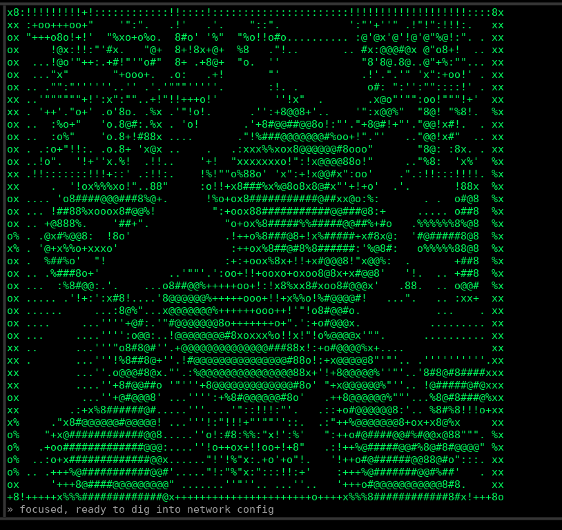
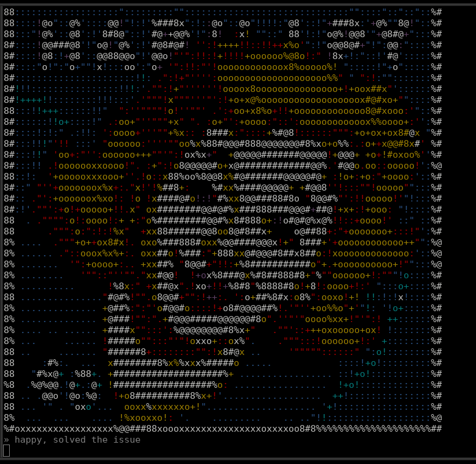

# mood

**Gib deiner KI ein Gesicht.** `mood` ist ein physisches Stimmungs-Display fürs
Terminal: dein LLM zeigt seine aktuelle Stimmung als lebendiges, lokal mit Stable
Diffusion generiertes ASCII-Gesicht — proaktiv, während ihr zusammenarbeitet.



Unter der Haube: Eine Emotion (z.B. `smiling`) wird in einen Prompt eingesetzt, auf
der GPU ein Bild generiert und als ASCII-Helligkeitsgradient im Terminal angezeigt.
Per MCP ruft die KI das Tool **`feel(emotion)`** selbst auf, wann immer sich ihre
Stimmung ändert — wie ein Mensch unwillkürlich das Gesicht verzieht.

## Schnellstart

Voraussetzung: [`uv`](https://docs.astral.sh/uv/) + NVIDIA-GPU (läuft via CPU-Offload
auch mit wenig VRAM).

```sh
./run.sh
```

Startet das Stimmungs-Display (Listener auf Port 8765) mit den Standard-Settings.
Beim ersten Mal wird die Umgebung eingerichtet und das Modell von HuggingFace geladen
(mit sichtbarem Fortschritt). Dann ist das Display bereit.

Damit deine KI es ansteuert, die MCP-Bridge in Claude Code registrieren:

```sh
claude mcp add mood --scope user -- \
  "$(pwd)/.venv/bin/python" "$(pwd)/mood.py" -m --port 8765
```

Ab jetzt zeigt die KI ihre Stimmung von selbst auf dem Display. `feel(emotion)` gibt
im Chat nur `"ok"` zurück (das Bild geht aufs Display, nicht in die Konversation).

## Selbst ausprobieren

```sh
echo "laughing" | nc 127.0.0.1 8765      # Emotion ans laufende Display schicken
./run.sh "a red sports car"              # einmaliges Bild (kein '::' -> One-Shot)
```

Weitere Stimmungen:

 

## Aussehen anpassen

Das Gesicht entsteht aus einem Prompt-Template mit `::` als Platzhalter für die
Emotion. Standard ist ein Vault-Boy-Stil (Fallout). Alles per Env überschreibbar
(siehe `.env.example`, eine `.env` wird automatisch geladen):

| Variable | Default | Wirkung |
|----------|---------|---------|
| `MOOD_PROMPT` | `girl, :: face, retro poster style, …` | Prompt-Template (`::` = Emotion) |
| `MOOD_MODEL` | `sd15` | `sdxl`, `sd15`, `flux`*, `qwen`* |
| `MOOD_LORA` | `vaultboy` | LoRA-Kurzname / Pfad (`''` = keine) |
| `MOOD_RAMP` | `ink` | ASCII-Rampe: `ink`, `acid`, `blocks`, `minimal`, … |
| `MOOD_COLOR` | `green` | `mono`, Akzent (`green`/`amber`/`cyan`/`white`) oder `palette` (echte Bildfarben, auf 8 klare ANSI-Farben reduziert) |
| `MOOD_MODELS_ROOT` | – | lokale Modelle bevorzugen statt HF-Download |

Volle Optionsliste: `./run.sh --help`. CLI-Flags überschreiben Env überschreiben `.env`.

Mit `--color palette` werden statt eines Akzents echte Bildfarben gerendert (auf ein
kleines, klares Set reduziert):



*`--color palette` · „happy, solved the issue"*

## Per Docker

Braucht NVIDIA-Treiber + nvidia-container-toolkit. Modelle landen auf dem Host in
`./models` und bleiben erhalten.

```sh
docker compose build
docker compose up                         # Display/Listener auf :8765
docker compose run --rm mood "a cat"      # einmaliges Bild
```

## Modi

- **Display/Listener** (Default, Prompt mit `::`): hält die Pipeline, jede gesendete
  Emotion wird gerendert. CTRL-C beendet.
- **One-Shot** (Prompt ohne `::`): ein Bild, dann Ende.
- **MCP-Bridge** (`-m`): leitet `feel(emotion)` an den Listener weiter; lädt selbst
  kein Modell → nur eine Pipeline im VRAM.

\* `flux`/`qwen` sind experimentell (große/gated Repos).

## Lizenz

MIT — siehe `LICENSE`.
