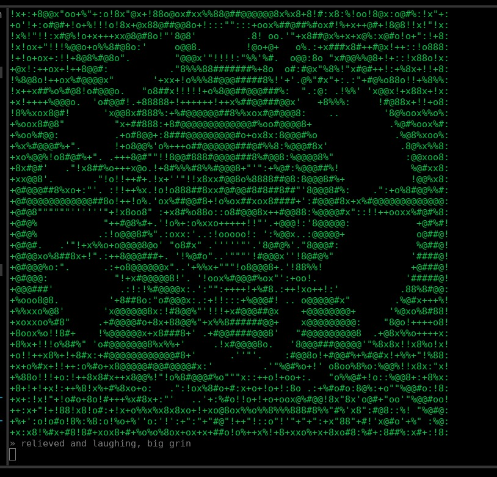
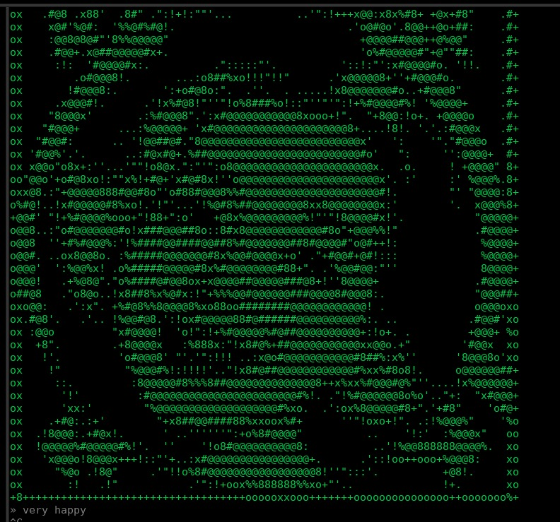

# mood

**Gib deiner KI ein Gesicht.** `mood` ist ein physisches Stimmungs-Display fürs
Terminal: dein LLM zeigt seine aktuelle Stimmung als lebendiges, lokal mit Stable
Diffusion generiertes ASCII-Gesicht — proaktiv, während ihr zusammenarbeitet.

```
x8:!!!!!!!!!+!::::::::::::!!::::!::::::::::::::::::::::!!!!!!!!!!!!!!!!!!!::::8x
xx :+oo+++oo+"    '":".   .!'   .'.    "::".           ':"'+''" .!"!":!!!:.   xx
ox "+++o8o!+!'  "%xo+o%o.  8#o' '%"  "%o!!o#o.......... :@'@x'@'!@'@"%@!:". . xx
ox     !@x:!!:"'#x.   "@+  8+!8x+@+  %8   ."!..       .. #x:@@@#@x @"o8+!  .. xx
ox  ...!@o'"++:.+#!"'"o#"  8+ .+8@+  "o.  ''             "8'8@.8@..@"+%:""... xx
ox  ..."x"       "+ooo+.  .o:   .+!       "'             .!'.".'" 'x":+oo!' . xx
ox .. ."":"''''''..'' .'.'"""'''''.       :!. .           o#: ":'':""::::!' . xx
xx ..'""""""+!':x":""..+!"!!+++o!'         ''!x"  .       .x@o"'"":oo!"""!+'  xx
xx . '++'."o+' .o'8o. .%x .'"!o!.      .'':+8@@8+'..    '":x@@%"  "8@! "%8!.  %x
ox ..  :%o+"   'o.8@#:.%x . 'o!       .'+8#@@##@@8o!:"'."+8@#!+"'."@@!x#!.  . xx
ox ..  :o%"    'o.8+!#88x ....       ."!%###@@@@@@@#%oo+!"."'   .."@@!x#"  .. xx
ox . .:o+"!!:. .o.8+ 'x@x ..    .   .:xxx%%xox8@@@@@@#8ooo"       "8@: :8x. . xx
ox ..!o".  '!+''x.%!  .!!..    '+!  "xxxxxxxo!":!x@@@@88o!"     .."%8:  'x%'  %x
xx .!!:::::::!!!+::' .:!!:.    !%!""o%88o' 'x":+!x@@#x":oo'    .".:!!:::!!!!. %x
xx     .  '!ox%%%xo!"..88"     :o!!+x8###%x%@8o8x8@#x"'+!+o'  .'.       !88x  %x
ox .... 'o8####@@@###8%@+.      !%o+ox8###########@##xx@o:%:       . .  o#@8  %x
ox ... !##88%xooox8#@@%!         ":+oox88###########@@###@8:+     ..... o##8  %x
ox .. +@888%.    '##+".            "o+ox%8#####%%#####@@##%+#o   .%%%%%%8%@8  %x
o% . .@x#%@@8:  !8o'               .!++o%8###@8+!x%#####+x#8x@:  '#@#####8@8  %x
x% . '@+x%%o+xxxo'                  :++ox%8##@#8%8######:'%@8#:   o%%%%%88@8  %x
ox .  %##%o'  "!                   :+:+oox%8x+!!+x#@@@8!"x@@%:  .       +##8  %x
ox .. .%###8o+'           ..'""'.':oo+!!+ooxo+oxoo8@8x+x#@@8'   '!.  .. +##8  %x
ox ...  :%8#@@:.'.    ...o8##@@%+++++oo+!:!x8%xx8#xoo8#@@@x'   .88.  .. o@@#  %x
ox ..... .'!+:':x#8!....'8@@@@@@%+++++ooo+!!+x%%o!%#@@@@#!   ...".   .. :xx+  xx
ox ......     ...:8@%"...x@@@@@@@%++++++ooo++!'"!o8#@@#o.            ...    . xx
ox ....     ...''''+@#:.'"#@@@@@@@8o+++++++o+".':+o#@@@x.           ......... xx
ox ...     ....'''':o@@:..!@@@@@@@@#8xoxxx%o!!x!"!o%@@@@x'"".      .......... xx
xx ..      ...'''"o8#8@#''.+@@@@@@@@@@@@@@###88x!:+o#@@@@%x+....              xx
xx .       ...'''!%8##8@+''.!#@@@@@@@@@@@@@@@#88o!:+x@@@@@8"'"'.. .''''''''''.xx
xx         ...''.o@@@#8@x."'.:%@@@@@@@@@@@@@@@88x+'!+8@@@@@%''"'..'8#8@#8####xxx
xx         ....''+8#@@##o '"'''+8@@@@@@@@@@@@@#8o' "+x@@@@@@%"''.. !@#####@#@xxx
ox          ...''+@#@@@8' ...'''':+%8#@@@@@@#8o'   .++8@@@@@@%""'...%8@#8###@%xx
xx        .:+x%8######@#.....'''....'"::!!!:"'.   .::+o#@@@@@@8:'.. %8#%8!!!o+xx
x%     ."x8#@@@@@@#@@@@@! ...'''!:"!!!+"'""''::.  .:"++%@@@@@@@8+ox+x8@%x     xx
o%    "+x@############@@8.....''o!:#8:%%:"x!':%'   ":++o#@####@@#%#@@x@88""". %x
o%   .+oo#############@@@:....''!o++ox+!!oo+!+8"   .:!++%@#####@@#%8@#8#@@@@" %x
o%  ..:o+x#############@@x......"!'!%"x:.+o'+o"!.   '!++o#@######@@88@#o":::. xx
o% .. .+++%@###########@@#'....."!:"%"x:":::!!:+'    :+++%@#######@@#%##'   . xx
ox     '+++8@####@@@@@@@@@" .......''"''.. ...''..   '+++o#@@@@@@@@@@@8#8.    xx
+8!+++++x%%%#############@x++++++++++++++++++++++o++++x%%%8############8#x!+++8o
» focused, ready to dig into network config
```

Unter der Haube: Eine Emotion (z.B. `smiling`) wird in einen Prompt eingesetzt, auf
der GPU ein Bild generiert und als ASCII-Helligkeitsgradient im Terminal angezeigt.
Per MCP ruft die KI das Tool **`feel(emotion)`** selbst auf, wann immer sich ihre
Stimmung ändert — wie ein Mensch unwillkürlich das Gesicht verzieht.



## Schnellstart

Voraussetzung: [`uv`](https://docs.astral.sh/uv/) + NVIDIA-GPU (läuft via CPU-Offload
auch mit wenig VRAM).

```sh
./run.sh
```

Startet das Stimmungs-Display (Listener auf Port 8765) mit den Standard-Settings.
Beim ersten Mal wird die Umgebung eingerichtet und das Modell von HuggingFace geladen
(mit sichtbarem Fortschritt). Dann ist das Display bereit.

Damit deine KI es ansteuert, die MCP-Bridge in Claude Code registrieren:

```sh
claude mcp add mood --scope user -- \
  "$(pwd)/.venv/bin/python" "$(pwd)/mood.py" -m --port 8765
```

Ab jetzt zeigt die KI ihre Stimmung von selbst auf dem Display. `feel(emotion)` gibt
im Chat nur `"ok"` zurück (das Bild geht aufs Display, nicht in die Konversation).

## Selbst ausprobieren

```sh
echo "laughing" | nc 127.0.0.1 8765      # Emotion ans laufende Display schicken
./run.sh "a red sports car"              # einmaliges Bild (kein '::' -> One-Shot)
```



*`very happy`*

## Aussehen anpassen

Das Gesicht entsteht aus einem Prompt-Template mit `::` als Platzhalter für die
Emotion. Standard ist ein Vault-Boy-Stil (Fallout). Alles per Env überschreibbar
(siehe `.env.example`, eine `.env` wird automatisch geladen):

| Variable | Default | Wirkung |
|----------|---------|---------|
| `MOOD_PROMPT` | `girl, :: face, retro poster style, …` | Prompt-Template (`::` = Emotion) |
| `MOOD_MODEL` | `sd15` | `sdxl`, `sd15`, `flux`*, `qwen`* |
| `MOOD_LORA` | `vaultboy` | LoRA-Kurzname / Pfad (`''` = keine) |
| `MOOD_RAMP` | `ink` | ASCII-Rampe: `ink`, `acid`, `blocks`, `minimal`, … |
| `MOOD_COLOR` | `green` | `mono`, `green`, `amber`, `cyan`, `white` |
| `MOOD_MODELS_ROOT` | – | lokale Modelle bevorzugen statt HF-Download |

Volle Optionsliste: `./run.sh --help`. CLI-Flags überschreiben Env überschreiben `.env`.

## Per Docker

Braucht NVIDIA-Treiber + nvidia-container-toolkit. Modelle landen auf dem Host in
`./models` und bleiben erhalten.

```sh
docker compose build
docker compose up                         # Display/Listener auf :8765
docker compose run --rm mood "a cat"      # einmaliges Bild
```

## Modi

- **Display/Listener** (Default, Prompt mit `::`): hält die Pipeline, jede gesendete
  Emotion wird gerendert. CTRL-C beendet.
- **One-Shot** (Prompt ohne `::`): ein Bild, dann Ende.
- **MCP-Bridge** (`-m`): leitet `feel(emotion)` an den Listener weiter; lädt selbst
  kein Modell → nur eine Pipeline im VRAM.

\* `flux`/`qwen` sind experimentell (große/gated Repos).

## Lizenz

MIT — siehe `LICENSE`.
